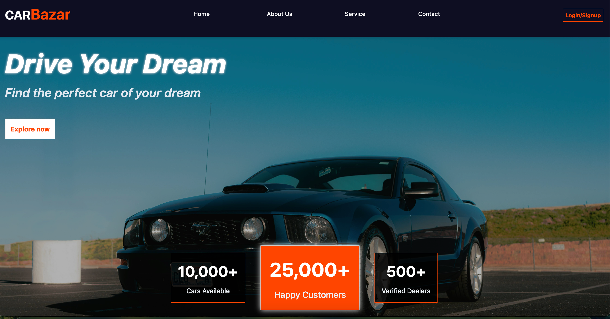

# 🚗 Car Bazar

## Description

Car Bazar is a lightweight React project that demonstrates **JWT-based authentication**. It includes secure **login**, **signup**, **logout**, and a **protected profile** page using a REST API backend.

---




## Tech Stack

- **React.js** (powered by **Vite** for fast builds)
- **Tailwind CSS** + custom CSS
- **JWT-based REST API** for user authentication

---

## Features

- **Signup** — Register a new user via API
- **Login** — Authenticate and receive JWT
- **Protected Profile Page** — Accessible only with valid token
- **Logout** — Clears stored token & redirects
- **Form Validation & Error Handling** — Friendly user feedback

---

## Prerequisites

- **Node.js** (v14+) and npm
- Running backend API with:
  - `POST /auth/signup`
  - `POST /auth/login`
  - `GET /auth/whoami`
  - `GET /cars/`

---

## Routing with React Router (v6+) & Dynamic Parameters

This app uses **React Router v6+** for client-side routing, supporting both protected routes and dynamic parameter routes—ideal for profile and car detail pages.

### Route Setup (in `App.jsx`)

```jsx
import { BrowserRouter, Routes, Route } from "react-router-dom";
import Login from "./components/Login";
import Signup from "./components/Signup";
import Profile from "./components/Profile";
import CarDetails from "./components/CarDetails";
import ProtectedRoute from "./components/ProtectedRoute";

function App() {
  return (
    <BrowserRouter>
      <Routes>
        <Route path="/" element={<Login />} />
        <Route path="/signup" element={<Signup />} />
        <Route
          path="/profile/:username"
          element={
            <ProtectedRoute>
              <Profile />
            </ProtectedRoute>
          }
        />
        <Route
          path="/cars/:carId"
          element={
            <ProtectedRoute>
              <CarDetails />
            </ProtectedRoute>
          }
        />
      </Routes>
    </BrowserRouter>
  );
}

export default App;
```
